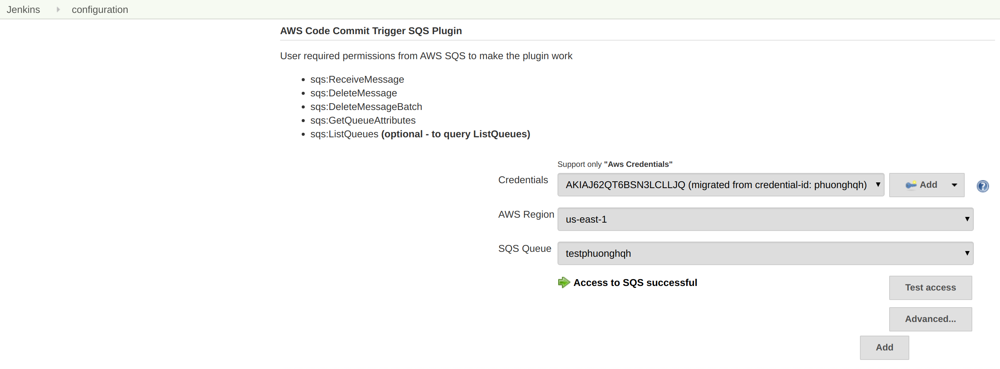
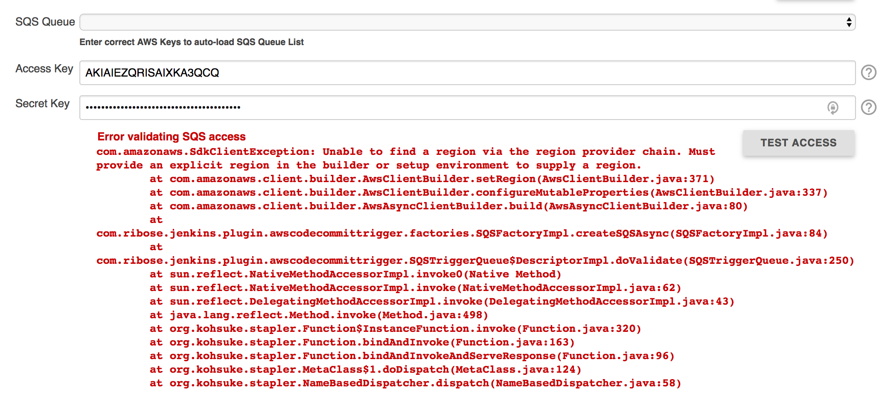
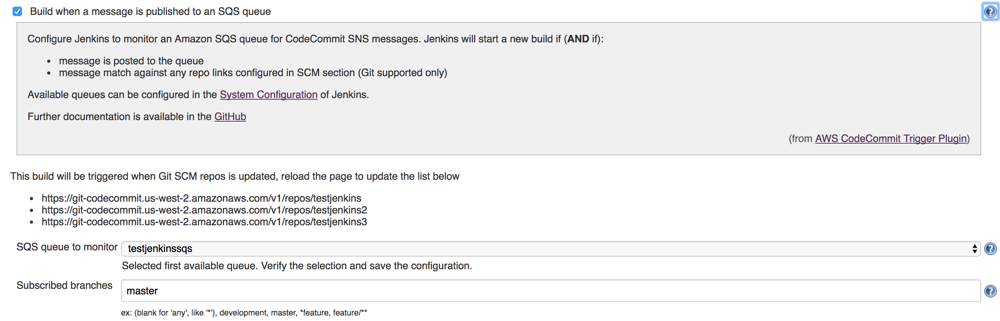

= AWS CodeCommit Trigger Plugin

image:https://img.shields.io/travis/jenkinsci/aws-codecommit-trigger-plugin.svg?style=flat-square[link=https://travis-ci.org/jenkinsci/aws-codecommit-trigger-plugin]
image:https://img.shields.io/:license-apache-blue.svg?style=flat-square[link=https://www.apache.org/licenses/LICENSE-2.0.html]


== Introduction

A Jenkins plugin that triggers jobs on repo update events by AWS
CodeCommit, through the AWS Simple Queue Service (SQS) and Simple
Notification Service (SNS).

The advantage over the original
https://github.com/jenkinsci/aws-sqs-plugin[AWS SQS Plugin] that this
plugin allows subscribing to multiple branches using the same SQS queue,
meaning that:

* you no longer need to create a SQS queue per CodeCommit repo
* an update to the `dev` branch will no longer trigger all jobs that
  subscribe to that CodeCommit repo.

The original https://github.com/jenkinsci/aws-sqs-plugin[AWS SQS Plugin]
was written (and still maintained) by
https://github.com/mpfeiffermway[Markus Pfeiffer] of M-Way Solutions
GmbH.

Our Jenkins Wiki Page is located here:
https://wiki.jenkins.io/display/JENKINS/AWS+CodeCommit+Trigger+Plugin

Use https://issues.jenkins-ci.org[JIRA] to report issues / feature requests


== Quick Setup With Terraform

Use the
https://github.com/riboseinc/tf-codecommit-sqs[tf-codecommit-sqs] module
to create your CodeCommit repos created with provided linkage with SQS/SNS.


== Manual Setup

General steps to config your Amazon Services:

1. Create a CodeCommit Repo
2. Open the Repo, create Triggers that will connect to a webhook through
   Amazon Simple Notification Service (SNS)
3. Create SNS Topic subscribe to a Simple Queue Service (SQS) queue
4. Open the SQS queue, do queue actions to subscribe it to SNS Topic
5. Make sure the AWS Credentials used for this Plugin has Permission to
   read/delete message from the SQS Queue.


=== Jenkins System Configuration

1. Go to `Jenkins > Manage Jenkins > Configure System` on your Jenkins

2. Go to `AWS Code Commit Trigger SQS Plugin`

3. Configure a queue

    * Select the name of the queue you just created (the list auto-loaded using _Access key ID_ & _Secret key_)
    * Enter the _Access key ID_ of the Jenkins user on AWS
    * Enter the _Secret key_ of the Jenkins user on AWS

4. Click on *Test access*

You should see a success message as in the screenshot below. If you get
an error message make sure you entered the credentials correctly. If you
still see errors double check the user, group and permissions you set up
on Amazon Web Services.



If you get the error `Unable to find a region via the region provider chain`,
create the directory `.aws` inside the Jenkins home directory.
Then inside the `.aws` directory add the `config` file with the following configuration.

```
[default]
output = json
region = <region where is your repository>
```



== Jenkins Job Configuration

1. Go to `Jenkins > $job`
2. Click on `Configure`
3. Scroll down to `Build Triggers`
4. Check `Build when a message is published to an SQS queue`
5. Select the queue you created previously

For cost savings, the plugin does not start monitoring a queue until at
least one job has been configured to listen to messages from a queue.

You can use the same queue for multiple jobs or you can create a new
queue for each job. Keep in mind that monitoring multiple queues will
increase the amount of requests your Jenkins will have to send to AWS.

Normally you would use the same queue and topic for multiple jobs, but
for billing purposes it may be easier to use multiple queues, especially
if you're running builds on behalf of a customer.


== Test your setup

If you've set up everything correctly pushing a change to the Git
repository on CodeCommit should now trigger a build on Jenkins. If
nothing happens, make sure the job has been set to use messages posted
to SQS as a build trigger.



== Contributing

1. Fork it
2. Create your feature branch (`git checkout -b my-new-feature`)
3. Write your code **and tests**
4. Ensure all tests still pass (`mvn clean verify -Pit`)
5. Commit your changes (`git commit -am 'Add some feature'`)
6. Push to the branch (`git push origin my-new-feature`)
7. Create new pull request


== Authors

AWS CodeCommit Trigger Plugin is provided by
https://www.ribose.com[Ribose Inc.]
(GitHub page: https://github.com/riboseinc[Ribose Inc.])


== License

Full text: link:LICENSE[Apache License]
