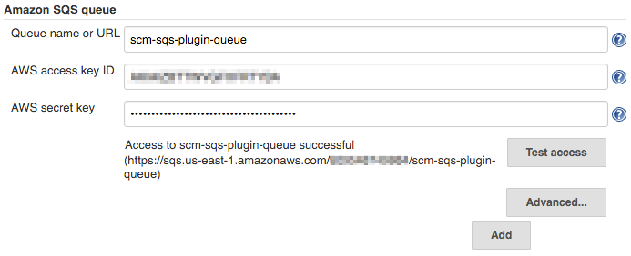
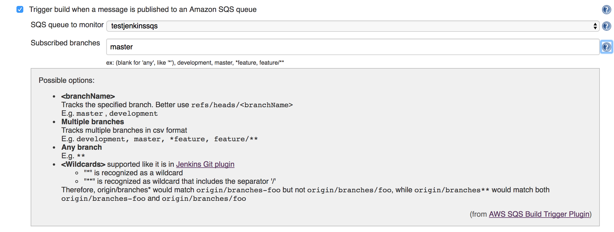

# AWS CodeCommit Trigger Plugin

A Jenkins plugin that allows to uses Events from Amazon CodeCommit Repo sent to Amazon Simple Queue Service (SQS) as a build trigger 

**NOTE** This plugin not check out the Repo.

Bellow are general steps to config your Amazon Services:

1. Create a CodeCommit Repo
2. Open the Repo, create Triggers that will connect to a webhook through Amazon Simple Notification Service (SNS)
3. Create SNS Topic subscribe to a Simple Queue Service (SQS) queue
4. Open the SQS queue, do queue actions to subscribe it to SNS Topic
5. Make sure the AWS Credential used for this Plugin has Permission to read/delete message from the SQS Queue.

# Table of contents
- [Using the plugin](#using-the-plugin)
    - [Jenkins System Configuration](#jenkins-system-configuration)
    - [Jenkins Job Configuration](#jenkins-job-configuration)
    - [Test your setup](#test-your-setup)
- [License](#license)
- [Maintainer](#maintainers)

### Jenkins System Configuration

1. Go to `Jenkins > Manage Jenkins > Configure System` on your Jenkins

2. Go to `Amazon Simple Queue Service`

3. Configure a queue

    * Enter the name of the queue you just created
    * Enter the *Access key ID* of the Jenkins user on AWS
    * Enter the *Secret key* of the Jenkins user on AWS

4. Click on **Test access**

You should see a success message as in the screenshot below. If you get an error message make sure you entered the credentials correctly. If you still see errors double check the user, group and permissions you set up on Amazon Web Services.

### Jenkins Job Configuration

1. Go to `Jenkins > $job`
2. Click on `Configure`
3. Scroll down to `Build Triggers`
4. Check `Trigger build when a message is published to an Amazon SQS queue`//TODO
5. Select the queue you created previously

To reduce cost the Jenkins plugin does not start monitoring a queue until at least one job has been configured to listen to messages from a queue.

You can use the same queue for multiple jobs or you can create a new queue for each job. Keep in mind that monitoring multiple queues will increase the amount of requests your Jenkins will have to send to AWS. Unless you have specific needs reusing the same queue and topic for multiple jobs is completely acceptable. For billing purposes it may be easier to use multiple queues, especially if you're running builds on behalf of a customer.

### Test your setup

If you've set up everything correctly pushing a change to the Git repository on CodeCommit should now trigger a build on Jenkins. If nothing happens, make sure the job has been set to use messages posted to SQS as a build trigger.

# Authors
AWS CodeCommit Plugin is contributed by [Ribose Inc.](ribose.com)

AWS CodeCommit Plugin was originally written (and still maintained) by [Markus Pfeiffer](https://github.com/mpfeiffermway) of M-Way Solutions GmbH.

# License

Apache License Click on the [Link](LICENSE) to see the full text.
